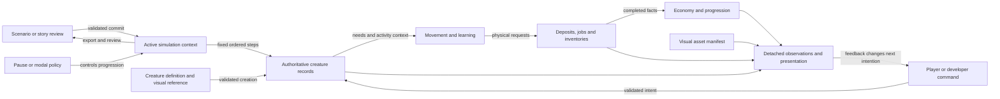

# Littlewild systemic design and developer boundaries

## Source and application

This review uses the user-supplied Playtank text headed **Your Next Systemic Game**, credited to **mannander**, dated **2025-12-12**. The original supplied [Playtank link](https://playtank.io/2024/06/12/designing-a-systemic-game/) could not be fetched under the environment's network policy; its live contents were not independently verified. The supplied text is the evidence for the principles below.

The article's **Model → Deconstruction → Reconstruction** sequence adds a design lens to the ECS research. Component storage alone does not explain why the game is understandable or engaging. Model the player activity first, identify shared capabilities and states, then reconnect their inputs, outputs and feedback. The article distinguishes application/setup/simulation states; object condition, context, response, awareness, perception and scripted states; and the authored rules that connect them.

## Model and commitment

Littlewild's current model is a small living colony: players choose work, support individual creatures, build useful places and see the colony's needs, resources and opportunities change. Its repeatable interaction is **inspect → choose an intention → observe the result → adjust**. This is a reading of the implemented prototype, not evidence that players understand or enjoy it; human playtesting remains necessary.

Non-negotiable implementation commitments:

- One authoritative persisted colony state; transient ECS projections refer to it.
- Existing fixed simulation steps, actor order and random draw order preserve deterministic continuation.
- Creatures have capabilities defined through validated data and compiled systems; appearance does not select species behavior.
- Imports review and activate data atomically. A reviewed preview binds to exact data and registry revisions.
- Explicit pause/modal states control simulation progression and preserve cancellation/focus.
- Developer tools use stable commands and detached observations; the player interface need not expose engine internals.

## Deconstruction: capability and feedback contracts

| Part | Inputs and context | Authoritative output | Existing feedback / validation boundary |
| --- | --- | --- | --- |
| Creature identity | Archetype, personality, validated defaults and spawn mode | Persistent identity and owned component records | Roster/portrait/world appearance; factory and identity validation |
| Creature needs | Fixed step, shelter/activity context, data-authored physiology | Food/water/energy/comfort/joy and feelings | Status/condition/activity views; finite bounds and actor ECS tests |
| Learning | Chosen activity/style, prior learning state, tuning | Practice, fatigue, recovery and progression | Skill/activity/progression views; deterministic actor/economy tests |
| Physical work | Actor intent, path, worksite/deposit state and recipe | Movement, reserved inputs, jobs and output inventory | Task/production status; preflight and conservation tests |
| Economy | Validated completed work/quest facts, immutable rules | Resources, XP, chapters and reward outbox | Progression/quest views; atomic settlement and duplicate markers |
| Visual asset | Data-selected visual ID, personality profile, rig/material/socket contract | Rendered model and attachments, no gameplay mutation | World/portrait representation; catalog validation and renderer parity |
| Setup and import | Pack/story review plus active registry revisions | Newly constructed or continued engine with captured profile | Preview/errors/commit confirmation; tamper/stale review regressions |
| Developer session | Reviewed scenario/story, validated commands and bounded steps | Detached observations and portable state | Typed result/error contracts and executable examples |

The article's **has a** distinction is applied through capability composition: archetype identity does not warrant a separate species-specific simulation or renderer branch. Shared required persistent fields remain stable; additional owned data components can widen a creature without imposing absent fields on existing species. New algorithms still require trusted compiled implementation and appropriate ownership/tests.

Object state must retain an owner. Conditions such as recovering belong to creature state; relative activity/shelter is step context; physiology and animation responses are validated definition data; progression observes authoritative state; future perception mechanics need explicit stimuli and observation contracts. Merely naming these categories does not mean Littlewild implements stealth, chemistry, combat or arbitrary designer scripting.

## Reconstruction: state-space map

Structural ECS commands become visible at the scheduler's explicit flush boundary; ordinary component value changes are visible to later systems. Domain transactions preflight all mutable targets and stage the complete batch before settling it. Deferred execution alone cannot roll back changes to authoritative values. The session/toolbox lifecycle makes the existing single-active-registry context explicit rather than implying multi-world isolation.

## Improvements adopted in this pass

The research plan closes reviewed-data, write-target, initialization and deterministic-order gaps before broadening authoring. Creature gameplay and visual manifests are co-located under `source/assets/creatures/<id>/`; defaults and visual references are data-selected. A nondefault creature must pass real creation, ECS, visual identity and save-continuation tests. The developer toolbox presents capabilities through a small public contract, with examples and actionable errors, rather than requiring callers to traverse the global facade.

## Next design experiments and evidence thresholds

Human tests should establish whether players can predict a creature's needs, understand a blocked job, explain a resource transfer and use feedback to change the next decision. These are playtest questions, not claims of completed validation. A new interaction should have a short contract recording inputs, outputs, feedback, triggers and target-deletion policy before adding components. Cross-capability tests should verify conservation and deterministic continuation instead of asserting that a new component exists.

Keep authored quest/scenario beats distinct from emergent combinations. Add perception graphs, generic rule interpreters, query caches or parallel scheduling only when an implemented mechanic or representative profile demonstrates a need. Each such change should explain its new ownership, ordering, invalidation and feedback costs.
