# Developer toolbox: model and adoption decisions

The toolbox makes the existing motorsport model accessible to native developers,
automation and coding agents. A principal commits scarce cash, people, facility
capacity and physical parts; a pitwall issues bounded intentions; physical running
produces facts that inform the next commitment. Application transactions and
queries remain the rule owners. See the [API and quickstart](../developer-toolbox.md).

## Model, deconstruction and reconstruction

The supplied Playtank text is **Your Next Systemic Game**, attributed to mannander,
dated **12 December 2025**. Its three stages are Model, Deconstruction and
Reconstruction. The article describes gameplay as action, feedback and revised
intention, proposes one-page descriptions of relationships/inputs/outputs/feedback/
triggers, and connects them in a state-space map. The supplied first line is a
prior message about an HTTP 403, rather than article content. The separately
requested 2024 URL returned HTTP 403; this document does not claim to have read it.

For this game, the model has three connected loops:

| Loop | Player intention | Authoritative consequence | Feedback |
|---|---|---|---|
| Race, fixed steps | Send out, box, change pace or engine mode | Existing physical movement, service and resource rules | Detached timing, car condition, accepted commands and observed events |
| Preparation, dated slots | Commit spending, employ/reserve people, schedule work, install parts | Existing cash, availability, capacity and engineering transactions | Forecasts, conflicts, readiness blockers and projected performance profiles |
| Events and seasons | Enter, approve sessions, finish and review | Frozen entry, factual receipt, atomic consequences and immutable awards | Results, standings, reconciled cash/resources and next-event context |

The graph names application boundaries rather than arbitrary game-object types:

```mermaid
flowchart LR
    Content[Validated authored content] --> Plan[Campaign planning checkpoint]
    Plan -->|inspect only| Ready[Readiness and blockers]
    Plan -->|explicit dated progression| Due[Due commitments and obligations]
    Due --> Ready
    Ready -->|explicit departure| Manifest[Frozen manifest and race entry]
    Manifest -->|optional practice approval| Practice[Physical practice]
    Manifest -->|qualifying approval| Qualifying[Physical qualifying]
    Practice -->|close and approve| Qualifying[Physical qualifying]
    Qualifying -->|close and approve| Grid[Grid and formation]
    Grid -->|approve start| Race[Physical race]
    Orders[Pitwall intentions] --> Race
    Race --> Feedback[Detached observations]
    Feedback --> Orders
    Race -->|finished factual record| Result[Result and receipt]
    Result -->|explicit atomic settlement| Plan
    Result --> Awards[Immutable sporting awards]
    Awards --> Season[Season progression and review]
    Season --> Plan
```

Actual production phases and preconditions decide whether each transition is
available. Closing a session can require physical returns before the next
approval. A graph edge is a relationship, not permission to skip its transaction.
Menu navigation, panel selection and settings are presentation states orthogonal
to this graph. They cannot advance race or campaign time.

## Action cards and vocabulary

Discovery describes each implemented operation by its stable name, named native
method, argument schema, clock effect, persistence effect and examples. Reading
the descriptor assists a caller; the invoked production owner decides acceptance.

| Verb | Inputs and owner | Outputs and feedback | Boundary |
|---|---|---|---|
| Inspect readiness | Frozen candidate entry and campaign checkpoint; `CampaignReadinessQuery` | Blockers, warnings and evidence | Read-only; inspection spends no cash or time |
| Commit | Explicit dated obligation; `CampaignFinanceTransaction` | Complete candidate checkpoint or rejection | A commitment is not spendable cash; due settlement owns payment |
| Advance to event | Current checkpoint; `CampaignDirectorTransaction` | Next departure context and settled due obligations | Campaign slots; atomic checkpoint publication |
| Depart | Recorded entry, mappings and staffing; `CampaignDepartureTransaction` | Frozen manifest, reservations and checkpoint | Readiness must pass; no second race setup |
| Command | Action and explicit driver payload; `RaceCommands` | Acceptance or owner error, followed by physical observations | Intent is distinct from completed pit service or an observed pass |
| Settle | Own finished factual record and frozen manifest; `CampaignWeekendTransaction` | Receipt and complete consequences | No invented diagnoses, fabricated receipts or partial ledger repair |
| Edit | Draft and observed revision; `TrackEditorSession` | New revision/history or rejection | Draft validity differs from publication validity |

An accepted command describes an authorized intention. An observation describes
what happened. An estimate describes assumptions about a possible future. Keep
these three kinds of feedback distinguishable in recipes and result consumers.

## Excalibur source study and bounded adoption

The reference is the canonical Excalibur repository at
[`2c37dbd6fa4b94eebd0076d9cfd84b96f1aa8f2b`](https://github.com/excaliburjs/Excalibur/tree/2c37dbd6fa4b94eebd0076d9cfd84b96f1aa8f2b),
whose package declares version 0.32.0. The direct best-practices page returned
HTTP 403. The following maintainer documentation, actual source and tests were
read; their patterns are adapted to the existing Godot ownership model.

| Reference and concrete behavior | Adoption here |
|---|---|
| [Patterns](https://github.com/excaliburjs/Excalibur/blob/2c37dbd6fa4b94eebd0076d9cfd84b96f1aa8f2b/site/docs/12-other/11-patterns.mdx): small entry point, resource/configuration ownership and scene composition root | A factory assembles a sealed catalog and application facets; the transport entry point handles protocol and lifecycle |
| [EngineOptions](https://github.com/excaliburjs/Excalibur/blob/2c37dbd6fa4b94eebd0076d9cfd84b96f1aa8f2b/src/engine/engine.ts): declared configuration and separate fixed-update settings | Named, discoverable configuration inputs select existing authored weekends and registered mechanics; physics remains unchanged |
| [TestClock](https://github.com/excaliburjs/Excalibur/blob/2c37dbd6fa4b94eebd0076d9cfd84b96f1aa8f2b/src/engine/util/clock.ts) and [clock tests](https://github.com/excaliburjs/Excalibur/blob/2c37dbd6fa4b94eebd0076d9cfd84b96f1aa8f2b/src/spec/vitest/clock-spec.ts): starting alone does not tick; explicit stepping supplies elapsed time; stopped clock does not step | Tool sessions advance only on explicit requests; exact race ticks and supplied elapsed time remain distinct operations |
| [Scene initialization](https://github.com/excaliburjs/Excalibur/blob/2c37dbd6fa4b94eebd0076d9cfd84b96f1aa8f2b/src/engine/scene.ts): one-time initialization with explicit order before children | Assemble once, validate before publishing a session, and close owned collaborators explicitly |
| [Typed EventEmitter](https://github.com/excaliburjs/Excalibur/blob/2c37dbd6fa4b94eebd0076d9cfd84b96f1aa8f2b/src/engine/event-emitter.ts) and [subscription tests](https://github.com/excaliburjs/Excalibur/blob/2c37dbd6fa4b94eebd0076d9cfd84b96f1aa8f2b/src/spec/vitest/event-emitter-spec.ts): named events and removable subscriptions | Detached bounded observation queues and cleanup on close; observations do not execute sporting consequences |
| [Engine Fundamentals](https://github.com/excaliburjs/Excalibur/blob/2c37dbd6fa4b94eebd0076d9cfd84b96f1aa8f2b/site/docs/02-fundamentals/04-architecture.mdx): update/draw separation and warning against subscription-order dependence | Queries and rendering never tick; explicit mechanic and transaction ordering remain authoritative |
| [Conventions](https://github.com/excaliburjs/Excalibur/blob/2c37dbd6fa4b94eebd0076d9cfd84b96f1aa8f2b/site/docs/02-fundamentals/02-conventions.mdx): stated time units and coordinate spaces | Declare race seconds/ticks, campaign slots, integer monetary minor units and editor coordinates without borrowing Excalibur's millisecond convention |

This is an architectural adaptation, not an Excalibur runtime integration or a
physics/ECS rewrite. No Excalibur source is copied into the game. Existing
`STEP = 0.05`, arithmetic, random-draw order, registered mechanic hook order,
sporting characterization and save contracts remain in force. The reference's
BSD-2-Clause license remains in its own repository.

## Developer and coding-agent workflow

Discover the available operations, inspect their descriptors, select a validated
content definition, and run a small explicit sequence. Record the actual execution
identity and snapshots, then compare factual observations against the hypothesis.
Keep tick budgets and process timeouts finite. A batch is an ordered sequence with
real prefix outcomes; it is not a transaction across different authorities.

Use the native API for Godot tooling and tests. Use the Python client or JSON
protocol for external automation. Both reach the same application facets, so
neither transport validates alternative sporting rules. External callers receive
JSON values, never a live car, runner, aggregate or mutable track geometry.

Source-pinned automated checks establish implementation behavior. Bounded
tool runs and synthetic states do not establish balance, human comprehension,
accessibility or representative-hardware performance. Those remain separate
validation activities recorded in [current status](../current-state.md).
