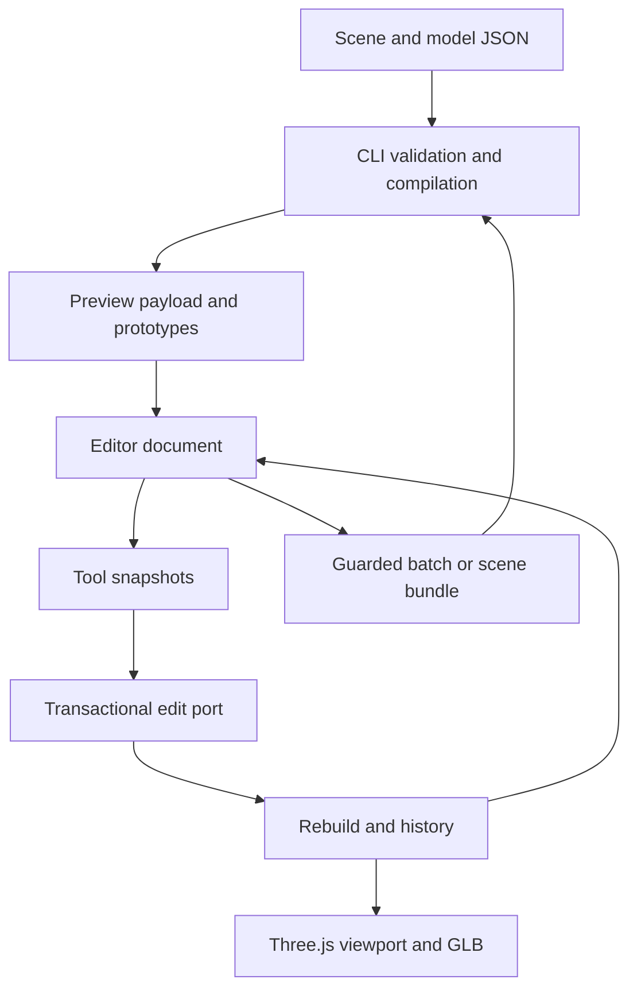

# Extending the editor

Scene Forge's browser is an offline document editor over compiled model prototypes. A tool reads snapshots, performs one document transaction, and lets the host rebuild, record undo and refresh the UI. It has no filesystem access and does not run the procedural compiler.

## Data flow



The source recipe owns node placement, rig definitions, material overrides and environment settings. Three.js owns only derived objects. Selection, camera orbit, open panels, playback time and joint overlays are transient UI state. `Save edits` serializes a diff; `Save bundle` serializes a portable source snapshot; GLB serializes the current render graph and animation clips.

## Integration seams

| Responsibility              | Entry point                                                                                                             | Rules                                                                                                                |
| --------------------------- | ----------------------------------------------------------------------------------------------------------------------- | -------------------------------------------------------------------------------------------------------------------- |
| Tool contract and lifecycle | `src/preview/tool-host.ts`                                                                                              | Unique ID; mount once; refresh from snapshots; abort listeners and release resources on disposal.                    |
| Built-in tool registration  | `src/preview/tools/index.ts`                                                                                            | Add an `EditorTool` to this array. No viewer changes for an inspector tool using existing capabilities.              |
| Tool data/write ports       | `src/preview/tool-bridge.ts`                                                                                            | Clone reads. All source writes pass through `edit`. Runtime objects and renderer are not exposed.                    |
| Undo and edit serialization | `src/preview/edit-state.ts`                                                                                             | Nodes, scene materials and environment form one transaction. Selection accompanies history but alone is not an edit. |
| Derived scene lifecycle     | `src/preview/templates.ts`, `../model-forge/src/kernel/render/realization.ts`                                           | Clone compiled geometry; realize materials, lights and rigs; own and dispose transient resources.                    |
| Viewport and overlays       | `../model-forge/src/kernel/render/viewport.ts`, `src/preview/rig-overlay.ts`                                            | Camera/render-only state stays out of the document. Export excludes overlays and studio lights.                      |
| Portable export graph       | `../model-forge/src/kernel/application/gltf-scene.ts`                                                                   | Clone skeletons safely, retain deterministic UUIDs, put skin meshes at glTF scene root. Never mutate the live scene. |
| Schema and semantics        | `../model-forge/src/kernel/domain/schema*.ts`, `validate.ts`, `rig.ts`; Scene Forge contracts in `src/domain/schema.ts` | Strict data contracts, references, cycles, bounds and budgets. Generated JSON Schemas are build outputs.             |
| CLI discovery               | `src/commands/discovery.ts`, command registrar                                                                          | Describe accepted data, flags, limits and actionable errors. Register a command group in `create-cli.ts`.            |

Paths under `../model-forge/src/kernel/` belong to the shared model recipe kernel owned by Model Forge (see [ARCHITECTURE.md](ARCHITECTURE.md#model-authoring-moved-to-model-forge)). The browser reaches them only through `src/kernel-render.ts`; change them in Model Forge and rerun both projects' checks.

Tools are trusted, build-time TypeScript modules. This is an internal extension API, not a sandbox for downloaded third-party code. The application does not execute plugins or scripts from recipe JSON.

## Add an inspector tool

This complete example adds a button that hides the selected object:

```ts
import type { EditorTool } from '../tool-host.js';

export const hideTool: EditorTool = {
  id: 'hide-selection',
  label: 'Visibility',
  mount(container, context, signal) {
    const button = document.createElement('button');
    button.type = 'button';
    button.textContent = 'Hide selected object';
    container.append(button);
    button.addEventListener(
      'click',
      () => {
        const selected = context.selected();
        if (!selected) return;
        context.edit((draft) => {
          const node = draft.nodes.find((item) => item.id === selected.id);
          if (node) node.visible = false;
        });
      },
      { signal },
    );
    return {
      refresh() {
        button.disabled = !context.editable || !context.selected();
      },
    };
  },
};
```

Add the tool to `editorTools`, run the build, and regenerate the HTML. The host provides undo/redo, failed-edit rollback, dirty-state tracking, source display and guarded persistence. Use `textContent` for user-authored strings. Use the supplied abort signal for listeners and `dispose()` for timers, animation frames or other resources.

`context.edit` is synchronous and returns success/failure. Keep its callback synchronous and side-effect free except for its draft. Do not retain the draft or mutate snapshots after the call. Long-running work should prepare a result first, then apply a short transaction against freshly read state. Source selection is addressed by authored IDs; mesh binding paths are relative to the selected model.

The write port intentionally covers `nodes`, `materials` and `environment`. A new persistent concept requires extending the schema, state snapshot/diff, validation, realization and round-trip tests together. Do not hide new authored state in a tool closure or mutate a Three.js object directly. For new viewport interactions, add a narrow typed host capability like `previewAnimation` or `showJoints` rather than exposing the renderer.

## Add a core feature

1. Define strict data and generated schema support in the domain.
2. Add semantic validation and an actionable error code.
3. Implement deterministic expansion or realization in application code, with explicit resource ownership.
4. Add a CLI registrar or batch operation and update `catalog`.
5. Transport compiled output through the preview contract. Keep procedural geometry and CSG out of the browser bundle.
6. Add the editor tool if needed. A shared pure runtime adapter is appropriate for lights, materials and skinning; a second browser procedural compiler is not.
7. Verify a meaningful failure case and a CLI/browser/export round-trip. For new interchange features, run the Khronos validator and compare actual loaded geometry where relevant.

`npm run architecture:check` enforces import direction, the browser adapter allowlist, absence of runtime cycles, no explicit `any`, and the 800-line module cap. `npm run verify` also checks formatting, TypeScript, builds, core behavior and browser workflows.
